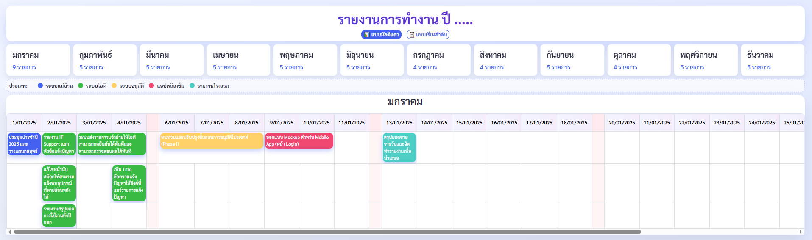

# Timeline of Year - Project Management Visualization

ระบบแสดงเส้นเวลาโครงการประจำปี (Timeline) ที่ช่วยให้สามารถติดตามความคืบหน้าของโครงการจากแต่ละฝ่ายงานได้อย่างชัดเจน

## 📋 Features (คุณสมบัติ)

- 📅 **Interactive Timeline View** - มุมมองเส้นเวลาแบบโต้ตอบ
- 🎨 **Beautiful UI** - ออกแบบด้วย Bootstrap 5 และ Sarabun Font
- 🔍 **Color-coded by Department** - แบ่งหมวดหมู่ตามฝ่ายงาน (IT, APP, HK, PAS, HT_Report)
- 📊 **Dynamic Data Rendering** - โหลดข้อมูลจาก CSV
- 🌐 **Thai Language Support** - รองรับภาษาไทยเต็มรูปแบบ
- 📱 **Responsive Design** - ทำงานได้บนอุปกรณ์ต่างๆ

## 📸 Screenshots (ตัวอย่าง)

### Timeline View


## 🚀 Getting Started (เริ่มต้นใช้งาน)

### Prerequisites
- Modern web browser (Chrome, Firefox, Safari, Edge)
- No installation required!

### Usage
1. Clone the repository
```bash
git clone https://github.com/yourusername/TimeLineOfYearWorker.git
cd TimeLineOfYearWorker
```

2. Open any HTML file in your web browser:
   - `2.html` - Timeline Report Version 2
   - `3.html` - Timeline Report Version 3

3. Data is loaded from `data.csv` automatically

### 🔗 Optional: Use Google Sheets Instead of CSV
Want to use Google Sheets for real-time data updates? See [GOOGLE_SHEETS_GUIDE.md](./GOOGLE_SHEETS_GUIDE.md) for step-by-step instructions.

## 📁 Project Structure

```
TimeLineOfYearWorker/
├── 2.html              # Timeline Report Version 2
├── 3.html              # Timeline Report Version 3
├── data.csv            # Project timeline data
├── README.md           # This file
└── DOCUMENTATION.md    # Detailed technical documentation
```

## 📊 Data Format

The `data.csv` file contains project timeline data with the following structure:

```csv
Department,Project Name,Start Date,End Date
HK,ประชุมประจำปี 2025 และวางแผนกลยุทธ์,2025/01/01,2025/01/01
IT,รายงาน IT Support แยกหัวข้อแจ้งปัญหา,2025/01/02,2025/01/02
APP,ออกแบบ Mockup สำหรับ Mobile App (หน้า Login),2025/01/09,2025/01/10
...
```

### Departments (ฝ่ายงาน)
- **HK** - Human Resources
- **IT** - Information Technology
- **APP** - Application Development
- **PAS** - Purchase & Supply Chain
- **HT_Report** - Sales Report

## 🎨 Color Scheme

| Department | Color |
|-----------|-------|
| HK | Blue (#4361ee) |
| IT | Green (#06d6a0) |
| APP | Warning (#ffd166) |
| PAS | Red (#ef476f) |
| HT_Report | Purple (#7209b7) |

## 💻 Technologies Used

- **HTML5** - Structure
- **CSS3** - Styling with modern features (Flexbox, Grid)
- **Bootstrap 5** - Responsive framework
- **Bootstrap Icons** - Icon library
- **JavaScript** - Dynamic functionality
- **Google Fonts (Sarabun)** - Thai font support

## 🔧 Customization

To customize the timeline:

1. Edit `data.csv` to add/modify project data
2. Add new departments by updating the color mapping in CSS
3. Modify the HTML files for layout changes
4. Adjust the CSS variables in `:root` for theme colors

## 📝 File Details

### 2.html & 3.html
Both files contain:
- Timeline visualization using HTML & CSS
- Data loading and processing with JavaScript
- Responsive grid layout
- Department-based filtering and styling
- Bootstrap components for styling

### data.csv
Contains 61 project records with:
- Department assignment
- Thai project descriptions
- Start date (YYYY/MM/DD format)
- End date (YYYY/MM/DD format)

## 🌐 Browser Compatibility

- Chrome/Chromium ✅
- Firefox ✅
- Safari ✅
- Edge ✅
- IE 11 ❌

## 📄 License

This project is open source. Feel free to use, modify, and distribute.

## 👥 Author

Created for project management and timeline visualization.

## 📞 Support

For issues or suggestions, please create an issue in the GitHub repository.

---

**Note:** This is a dashboard/reporting tool designed to work with timeline data. Data is read from the CSV file and rendered in the HTML timeline views.
